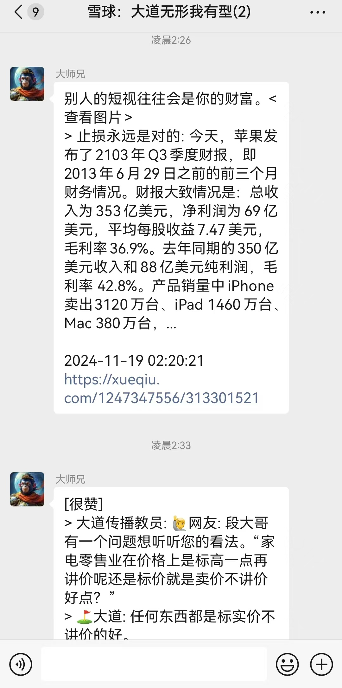

# plugin_rss
## 简介
一款适用于[chatgpt-on-wechat](https://github.com/zhayujie/chatgpt-on-wechat)项目的插件，支持通过RSS订阅各平台大V的最新消息，及时推送到微信群或微信号。


## 安装
- clone或下载本仓库源代码到[chatgpt-on-wechat](https://github.com/zhayujie/chatgpt-on-wechat)的plugins文件夹中
- 拷贝config.json.template到config.json，按需调整配置
- 启动chatgpt-on-wechat，即可自动加载并启用本插件

## 配置
参考config.json.template文件做订阅配置。

```json
[
  {
    "catalog": "xueqiu", # 类别，目前验证过xueqiu(雪球)与zhihu(知乎)
    "key": "duanyongping", # 同类别下唯一
    "duration_in_minutes": 3, # 几分钟拉取一次
    "url": [ # RSS源，带fallback机制，会自动选择成功率最高的url
      "https://rsshub.pseudoyu.com/xueqiu/user/1247347556",
      "https://rsshub.rssforever.com/xueqiu/user/1247347556",
      "https://yangzhi.app/xueqiu/user/1247347556",
      "https://rss.peachyjoy.top/xueqiu/user/1247347556"
    ],
    "receiver_name": [ # 接收新消息的微信名称（备注和昵称）
      "fred"
    ],
    "group_name": [ # 接收新消息的微信群名称
      "雪球：大道无形我有型"
    ]
  }
]
```
- RSS源请参考[RSSHub的Routes](https://docs.rsshub.app/routes/popular)，支持的站点还是很丰富的
- 官方源经常不可用，可以参考[Public Instances](https://docs.rsshub.app/guide/instances)多尝试几个三方部署，把可用的url配置到config里

## 其他
- 如果微信群不是机器人账号创建的，需要至少接收过一条消息才能推送
- 目前主要适配RSSHub的源，其他RSS源可能会有兼容问题。
- 任何想法、建议、需求、咨询、BUG等，欢迎加微信fred2025交流（备注rss）。

